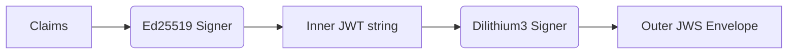

# Technical Architecture: Post-Quantum Secure OIDC Provider

This document provides a comprehensive overview of the internal workings, cryptographic choices, and security architecture of the Post-Quantum Secure OIDC Identity Provider.

## 1. System Overview
The goal of this project is to provide a standard-compliant OIDC Identity Provider that is resilient against future quantum computer attacks. It achieves this through **Hybrid Cryptography**, combining NIST-approved classical algorithms (Ed25519, X25519) with Post-Quantum primitives (Dilithium3, Kyber-768).

## 2. Layered Architecture
The project follows a **Hexagonal Architecture** (Ports & Adapters) to decouple business logic from infrastructure.

- **Domain Model (`internal/model`)**: Pure data structures (Client, User, Token).
- **Core Logic (`internal/core/oidc`)**: Orchestrates the OIDC flows (Authorize, Token).
- **Ports (`pkg/interfaces`)**: Define contracts for Repository, Signer, Hasher, and Encryptor.
- **Adapters**:
    - **Postgres (`internal/repository/postgres`)**: Persistent storage with atomic transactions.
    - **OpenBao (`internal/crypto/signer`)**: KMS-backed signing and encryption.
    - **API (`internal/api/handlers`)**: HTTP entry points.

## 3. Cryptographic Design

### 3.1. Nested Dual-Signing (Option A)
To ensure both current compatibility and future security, all ID tokens and Access tokens are dual-signed using a **Nested JWS** approach.



- **Inner Layer**: A standard Ed25519 JWT signed via OpenBao Transit. This ensures that current OIDC clients can still verify the token using classical logic.
- **Outer Layer**: The entire Ed25519 JWT string is treated as the payload for a Crystals-Dilithium3 signature. The header contains `{"alg":"Dilithium3","cty":"JWT"}`.

### 3.2. PQC Key Storage (Adapter Pattern)
Because most KMS (OpenBao/Vault) do not yet natively support Dilithium3, we use an **Encrypted Fallback Adapter**:
1.  **Generation**: Dilithium keys are generated via `circl`.
2.  **Protection**: The private key is encrypted with **AES-256-GCM** via the OpenBao Transit engine.
3.  **Storage**: The encrypted blob is stored in the `pqc_keys` table in PostgreSQL.
4.  **Signing**: On each sign request, the service fetches the blob, decrypts it in-memory via OpenBao, performs the sign, and wipes the raw key material.

## 4. Logical Data Flows

### 4.1. Authorization Code Flow with PKCE
The provider enforces strict **PKCE S256** to prevent authorization code interception attacks.

1.  **Authorize**: Validates client and redirect URI. Generates a raw code and stores its SHA3-256 hash along with the `code_challenge`.
2.  **Token Exchange**:
    - Client sends `code_verifier`.
    - Server hashes `code_verifier` and compares it to the stored `code_challenge` using **constant-time comparison**.
    - If valid, the code is atomically marked as `used`.

### 4.2. Atomic Token Rotation
Refresh tokens are rotated on every use. The database implementation uses a transaction to ensure that the old token is revoked and the new token is issued as a single atomic unit, preventing race conditions or replay attacks.

## 5. Security & Hardening
- **SHA3-256**: Used for all internal hashing (codes, nonces) for quantum resistance.
- **Rate Limiting**: Implemented at the middleware layer using a `ENDPOINT:IP:CLIENT_ID` keying strategy to prevent brute-force attacks on codes and client secrets.
- **Metadata Redaction**: The logging middleware is designed to avoid logging sensitive fields like `client_secret` or `refresh_token`.
- **KMS Source of Truth**: All private keys (except ephemeral Dilithium artifacts) stay within the OpenBao hardware security boundary.

## 6. Project Structure
```text
.
├── cmd/server/main.go      # Wire-up and Entry point
├── internal/
│   ├── api/                # Handlers & Middleware
│   ├── core/oidc/          # Service Orchestration
│   ├── crypto/             # Signer, Hasher, KEM implementations
│   ├── model/              # Domain Objects
│   └── repository/         # Database implementation
├── pkg/interfaces/         # Interface Definitions (Ports)
└── migrations/             # SQL Schema
```
