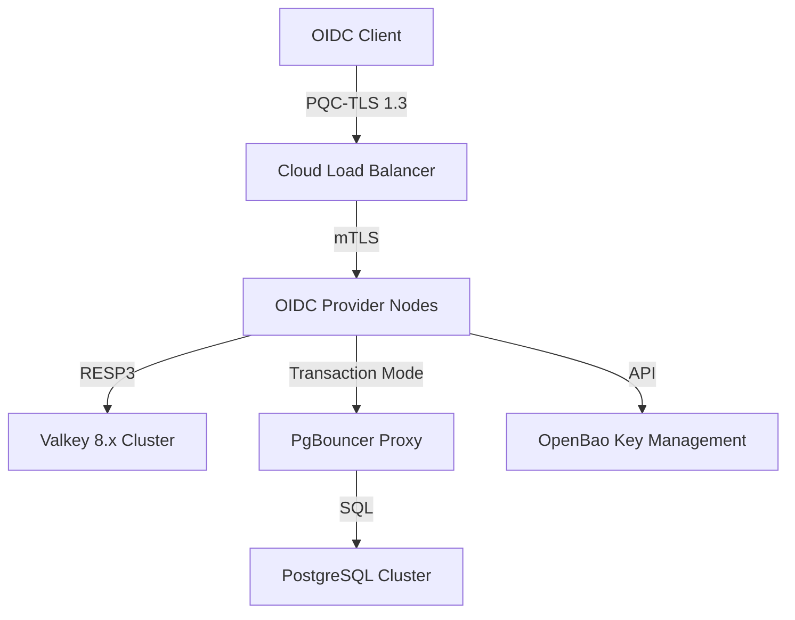

# Architecture Deep Dive

The PQC OIDC Provider is designed with a **Security-First, Performance-Always** philosophy. 

## 🏗️ High-Level Components

## 🔐 Hybrid PQC Signature Design

Existing OIDC clients cannot parse PQC-exclusive signatures. We solve this using a **Nested JWS** approach:

1.  **Inner Signature (Classical)**: An `Ed25519` signature is computed over the claims. This ensures the token is readable and verifiable by legacy systems.
2.  **Outer Wrap (Quantum)**: The classical JWT is wrapped in a second JWS layer signed with **Crystals-Dilithium3** (ML-DSA-65).
3.  **Discovery**: High-security clients detect Dilithium support via the `.well-known/openid-configuration` and verify the outer layer first.

## ⚡ 1M TPS Engineering

To achieve 1M TPS on commodity hardware, we implement three critical optimizations:

### 1. Asynchronous Audit Pipelines
Instead of per-request `INSERT` statements (which suffer from lock contention), we use a buffered channel that flushes events via the PostgreSQL `COPY` protocol in batches of 1,000+.

### 2. Lock-Free Memory Management
We utilize `sync.Pool` for all intensive allocations (e.g., JSON buffers, Hashers). This significantly reduces Garbage Collection (GC) pressure, which is the primary cause of latency spikes at scale.

### 3. Distributed Rate Limiting
Rate limiting is offloaded to **Valkey 8.x** using atomic Lua scripts. This ensures that even in a burst of 10M requests, the provider nodes remain responsive.
